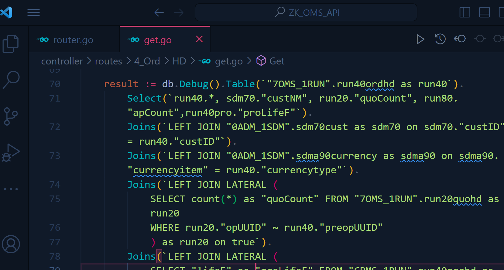

# 10.17 重點紀錄

### ZK_OMS_API 重複資料除錯
- 在某subQuery(用LATERAL)的table裡有重複的資料，如下
        
        ```Golang
            #...前略
            Joins(`
                    LEFT JOIN LATERAL (
                        SELECT "lifeF" as "proLifeF" 
                            FROM "6PMS_1RUN".run40prohd as run40pro
                            WHERE run40pro."preopUUID" = run40."opUUID"
                    ) as run40pro on true`
                )
            #...後略
        ```
- 除錯方法:
    - 先問chatGPT大概可能的原因，通常是出在關聯部分，因為直接去主table，資料是沒有重複的
    - 沒法解的話，只能自己去上面subQuery部份的table裡面去查詢比對資料，例如上面範例是 run40pro."preopUUID" = run40."opUUID"，此處run40是主表，所以要先去run40 複製重複的opUUID，再去run40pro裡面去查preopUUID和run40的opUUID有沒有相同且重複的(有幾個subQuery or join 就要做幾次)
    - 發現在run40pro裡面剛好就有3筆，找到原因!
    - 現在要求是只需要一筆，去問chatGPT: 只需在subQuery部分加上limit 1，如下:
        ```Golang
            #...前略
            Joins(`
                    LEFT JOIN LATERAL (
                        SELECT "lifeF" as "proLifeF" 
                            FROM "6PMS_1RUN".run40prohd as run40pro
                            WHERE run40pro."preopUUID" = run40."opUUID"
                            LIMIT 1
                    ) as run40pro on true`
                )
            #...後略
        ```
- 完成! 只會回傳一筆，不會有重複的了!